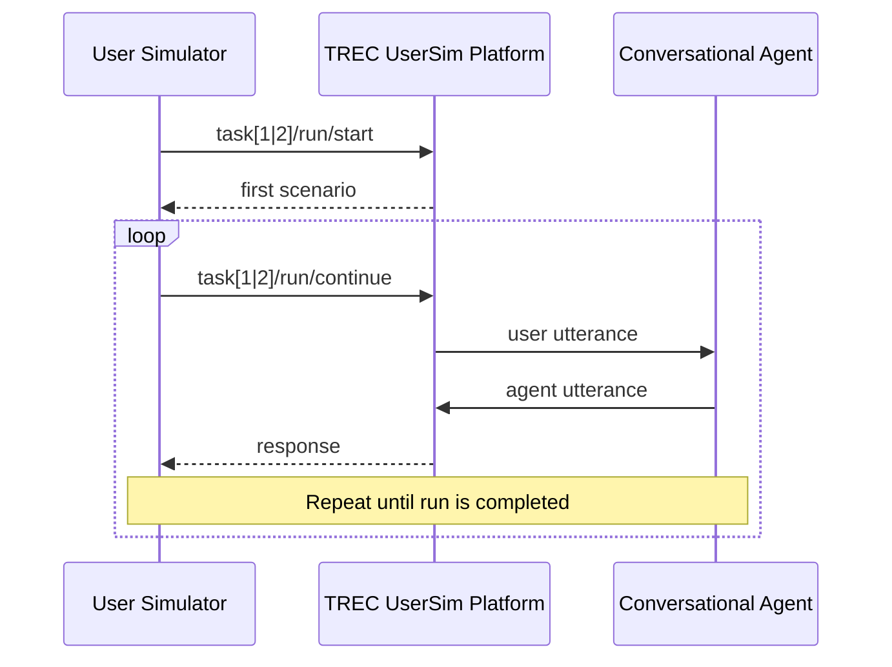

# TREC UserSim Baseline Simulator

> [!NOTE]
> This repository contains a baseline implementation to get started with developing your own user simulator for **TREC UserSim**. More details about the shared task can be found on the [official website](https://trec.usersim.ai/) and in the [guidelines](https://trec.usersim.ai/guidelines). The code integrates the API of the TREC UserSim platform and provides examples for user simulators with simple response strategies. 

**Contents** 
1. [TREC UserSim API](#trec-usersim-api)
2. [TREC UserSim Tasks and Example Outputs](#trec-usersim-tasks-and-example-outputs)
3. [Baseline User Simulator](#baseline-user-simulator)
4. [Setup and Getting Started](#setup-and-getting-started)
5. [Examples](#examples)

## TREC UserSim API

This figure is a high-level, condensed sequence diagram of how to interact with the TREC UserSim platform. More details about the interface can be found in the Swagger-based documentation page of the TREC UserSim API. A more detailed sequence diagram is provided [here](./docs/sequence.md).



The two most important API endpoints are:

- **`task[1|2]/run/start`** to start and initiate the run submission,
- **`task[1|2]/run/continue`** to continue completing the run submission.

A single run covers multiple scenarios (combinations of personas and goals) for which conversations with an agent have to be simulated. Information about the first scenario is returned to the user simulator in response to the first API call (cf. **`task[1|2]/run/start`**). 

Once the user simulated has generated an utterance it is sent to the TREC UserSim platform (cf. **`task[1|2]/run/continue`**). In response, the platform returns the corresponding interactive utterance made by the conversational agent. This process is repeated until the run is completed.

> [!NOTE]
> You are completely free to implement the API integration from scratch with any tools you prefer. However, if you want to getting started with the development of the user simulator right away, you may want to reuse the existing integration of the API in [`api_client.py`](./simulator/src/api_client.py)

## TREC UserSim Tasks and Example Outputs

### Task 1: Turn-level Next Utterance Prediction
> [!NOTE]
> This task focuses on a simulator’s ability to model the immediate, reactive behavior of a user at a single turn. It tests local conversational coherence and behavioral realism within an ongoing dialogue.
> - **Input:** A scenario and a partial conversation history (a sequence of preceding user and system turns) and the simulated user’s underlying initial information need.
> - **Output:** The single, predicted next user utterance. Participants may also include associated dialogue acts representing the semantic intent of the simulated utterance.

The client initiates the run with `POST task1/run/start`, which will return the first scenario and the chat history in the response. The client-side user simulator then generates the next utterance which is sent to the infrastructure and conversational agent with `POST task1/run/continue`. The response from the TREC UserSim platform contains next scenario and the corresponding chat history for which the next utterance has to be simulated. The client repeats `POST task1/run/continue` requests and simulates next utterances until the run is completed.

#### Example outputs

`POST task1/run/start`

**Response from the TREC UserSim Platform:**
```json
{
    "conversation_id": "5969273be4de4b21bbbe4e123f030f08",
    "scenario": {
        "goal": {
            "context": "We are exploring ideas from philosophy of language, and linguistics, that describe how conversations are structured. ...",
            "topic": "Recordings of natural-language conversations either between two people, or a person and a machine, ...",
            "discipline": "Social Sciences"
        },
        "persona": {
            "general_info": {
                "gender": "Female",
                "age": "18-34",
                "highest_education": "PhD/Doctorate",
                "proficiency_in_english": "Advanced",
                "tools_used_for_dataset_search": [
                    "Hugging Face Datasets",
                    "Kaggle"
                ]
            },
            "experience_with_ai": {
                "trust": "Very critical",
                "perceived_human_likeness": "High anthropomorphism"
            },
            "individual_traits": {
                "frustration_threshold": "Moderately quickly",
                "interaction_style": "Elaborate"
            }
        },
        "persona_goal_interaction": {
            "domain_familiarity": "Moderately familiar",
            "known_datasets": [
                "MultiWOZ",
                "TREC CAsT and TREC iKAT"
            ]
        }
    },
    "chat_messages": [
        {
            "timestamp": "2026-06-17T05:06:57.999383",
            "conversation_id": "fb0686887ecf4d24b69ff5454e0ca1a8",
            "participant_name": "user",
            "text": "I am looking for datasets of multi turn conversations. ...",
            "sources": [],
            "annotations": {},
            "is_final": false
        },
        {
            "timestamp": "2026-06-17T05:07:36.943677",
            "conversation_id": "fb0686887ecf4d24b69ff5454e0ca1a8",
            "participant_name": "agent",
            "text": "Below are a handful of public resources that meet most (or all) of the criteria you mentioned ...",
            "sources": [],
            "annotations": {
                "helpful": false,
                "dataset_quality": "Unlikely to be useful",
                "feedback": "The recommended datasets do not include multi-turn, goal-driven dialogue collections."
            },
            "is_final": false
        },
        {
            "timestamp": "2026-06-17T05:18:57.504701",
            "conversation_id": "fb0686887ecf4d24b69ff5454e0ca1a8",
            "participant_name": "user",
            "text": "Hmm, can you suggest any English, multi-turn, goal-driven dialogue collections?",
            "sources": [],
            "annotations": {},
            "is_final": false
        },
        {
            "timestamp": "2026-06-17T05:19:53.580027",
            "conversation_id": "fb0686887ecf4d24b69ff5454e0ca1a8",
            "participant_name": "agent",
            "text": "Below is a list of English, multi-turn, goal-driven dialogue collections ...",
            "sources": [],
            "annotations": {
                "helpful": false,
                "dataset_quality": "Some promising datasets",
                "feedback": ""
            },
            "is_final": false
        }
    ]
}
```

`POST task1/run/continue`

**Payload of the request:**
```json
{
    "run_id": "5d41402abc4b2a76b9719d911017c592",
    "user_utterance": {
        "timestamp": "2026-06-17T05:19:57.480027",
        "conversation_id": "fb0686887ecf4d24b69ff5454e0ca1a8",
        "participant_name": "user",
        "text": "Can you provide more details about the second dataset you mentioned, such as its size, the number of conversations, and the types of goals it covers?",
        "sources": [],
        "annotations": {},
        "is_final": false
  }
}
```

### Task 2: Session-level End-to-End Conversation Generation
> [!NOTE]
> This task evaluates a simulator’s ability to strategically manage an entire conversation to achieve a predefined goal. It tests high-level planning, conversational persistence, and the simulator's ability to recognize task success.
> - **Input:** A scenario that specifies the simulated user’s persona and goals.
> - **Output:** A complete, multi-turn conversation. The simulator must dynamically interact with the provided system, generating sequential turns until the simulator autonomously decides the goal is satisfied or that the search should be abandoned.

The client initiates the run with `POST task2/run/start`, which will return the first scenario in the response. The client-side user simulator then generates the first utterance which is send to the infrastructure and conversational agent with `POST task2/run/continue`. The corresponding response contains the chat history, including the utterance made by the agent in response to the simulated user's utterance. The user simulator continues the conversation by sending the next utterance with `POST task2/run/continue` until the conversation is finished.

#### Example outputs

`POST task2/run/start`

**Response from the TREC UserSim Platform:** 
```json
{
    "conversation_id": "5969273be4de4b21bbbe4e123f030f08",
    "scenario": {
        "goal": {
            "context": "We are exploring ideas from philosophy of language, and linguistics, that describe how conversations are structured. ...",
            "topic": "Recordings of natural-language conversations either between two people, or a person and a machine, ...",
            "discipline": "Social Sciences"
        },
        "persona": {
            "general_info": {
                "gender": "Female",
                "age": "18-34",
                "highest_education": "PhD/Doctorate",
                "proficiency_in_english": "Advanced",
                "tools_used_for_dataset_search": [
                    "Hugging Face Datasets",
                    "Kaggle"
                ]
            },
            "experience_with_ai": {
                "trust": "Very critical",
                "perceived_human_likeness": "High anthropomorphism"
            },
            "individual_traits": {
                "frustration_threshold": "Moderately quickly",
                "interaction_style": "Elaborate"
            }
        },
        "persona_goal_interaction": {
            "domain_familiarity": "Moderately familiar",
            "known_datasets": [
                "MultiWOZ",
                "TREC CAsT and TREC iKAT"
            ]
        }
    }
}
```

`POST task2/run/continue`

**Payload of the request:**
```json
{
    "run_id": "5d41402abc4b2a76b9719d911017c592",
    "user_utterance": {
        "timestamp": "2026-06-17T05:06:57.999383",
        "conversation_id": "fb0686887ecf4d24b69ff5454e0ca1a8",
        "participant_name": "user",
        "text": "Hello, I need datasets containing conversations to analyze how conversations are structured ...",
        "sources": [],
        "annotations": {},
        "is_final": false
  }
}
```

**Response from the TREC UserSim Platform:**
```json
{
    "conversation_id": "5969273be4de4b21bbbe4e123f030f08",
    "scenario": {...},
    "chat_messages": [
        {
            "timestamp": "2026-06-17T05:06:57.999383",
            "conversation_id": "fb0686887ecf4d24b69ff5454e0ca1a8",
            "participant_name": "user",
            "text": "Hello, I need datasets containing conversations to analyze how conversations are structured ...",
            "sources": [],
            "annotations": {},
            "is_final": false
        },
        {
            "timestamp": "2026-06-17T05:07:36.943677",
            "conversation_id": "fb0686887ecf4d24b69ff5454e0ca1a8",
            "participant_name": "agent",
            "text": "Greetings, below you can find several datasets that meet your requirements ...",
            "sources": [
                "https://aclanthology.org/D18-1547/", 
                "https://trec.nist.gov/data/cast.html"
            ],
            "annotations": {},
            "is_final": false
        }
    ]
}
```

## Baseline User Simulator

The table below provides short descriptions of how the baseline simulator is implemented in [`./simulator/src/`](./simulator/src/)

| File | Description | 
|---|---| 
| [`user_simulator.py`](./simulator/src/user_simulator.py) | integrates all other components and coordinates the interaction with the API, the scenario handling, and the response strategy. | 
| [`scenario.py`](./simulator/src/scenario.py) | contains the data classes of the scenario, including the persona, goal, and persona-goal interactions. | 
| [`response_strategy.py`](./simulator/src/response_strategy.py) | implements different strategies of how a simulated user generates utterances. | 
| [`api_client.py`](./simulator/src/api_client.py) | handles the interaction with the TREC UserSim API. | 

## Setup and Getting Started
1. Create virtual environment and install the required packages in `simulator/requirements.txt`

## TREC UserSim API

This figure is a high-level, condensed sequence diagram of how to interact with the TREC UserSim platform. More details about the interface can be found in the Swagger-based documentation page of the TREC UserSim API. A more detailed sequence diagram is provided [here](./docs/sequence.md).


The two most important API endpoints are:

- **`task[1|2]/run/start`** to start and initiate the run submission,
- **`task[1|2]/run/continue`** to continue completing the run submission.

A single run covers multiple scenarios (combinations of personas and goals) for which conversations with an agent have to be simulated. Information about the first scenario is returned to the user simulator in response to the first API call (cf. **`task[1|2]/run/start`**). 

Once the user simulated has generated an utterance it is sent to the TREC UserSim platform (cf. **`task[1|2]/run/continue`**). In response, the platform returns the corresponding interactive utterance made by the conversational agent. This process is repeated until the run is completed.

> [!NOTE]
> You are completely free to implement the API integration from scratch with any tools you prefer. However, if you want to getting started with the development of the user simulator right away, you may want to reuse the existing integration of the API in [`api_client.py`](./simulator/src/api_client.py)

## TREC UserSim Tasks and Example Outputs

### Task 1: Turn-level Next Utterance Prediction
> [!NOTE]
> This task focuses on a simulator’s ability to model the immediate, reactive behavior of a user at a single turn. It tests local conversational coherence and behavioral realism within an ongoing dialogue.
> - **Input:** A scenario and a partial conversation history (a sequence of preceding user and system turns) and the simulated user’s underlying initial information need.
> - **Output:** The single, predicted next user utterance. Participants may also include associated dialogue acts representing the semantic intent of the simulated utterance.

The client initiates the run with `POST task1/run/start`, which will return the first scenario and the chat history in the response. The client-side user simulator then generates the next utterance which is send to the infrastructure and conversational agent with `POST task1/run/continue`. The response from the TREC UserSim platform contains next scenario and the corresponding chat history for which the next utterance has to be simulated. The client repeats `POST task1/run/continue` requests and simulates next utterances until the run is completed.

#### Example outputs

`POST task1/run/start`

**Response from the TREC UserSim Platform:**
```json
{
    "conversation_id": "5969273be4de4b21bbbe4e123f030f08",
    "scenario": {
        "goal": {
            "context": "We are exploring ideas from philosophy of language, and linguistics, that describe how conversations are structured. ...",
            "topic": "Recordings of natural-language conversations either between two people, or a person and a machine, ...",
            "discipline": "Social Sciences"
        },
        "persona": {
            "general_info": {
                "gender": "Female",
                "age": "18-34",
                "highest_education": "PhD/Doctorate",
                "proficiency_in_english": "Advanced",
                "tools_used_for_dataset_search": [
                    "Hugging Face Datasets",
                    "Kaggle"
                ]
            },
            "experience_with_ai": {
                "trust": "Very critical",
                "perceived_human_likeness": "High anthropomorphism"
            },
            "individual_traits": {
                "frustration_threshold": "Moderately quickly",
                "interaction_style": "Elaborate"
            }
        },
        "persona_goal_interaction": {
            "domain_familiarity": "Moderately familiar",
            "known_datasets": [
                "MultiWOZ",
                "TREC CAsT and TREC iKAT"
            ]
        }
    },
    "chat_messages": [
        {
            "timestamp": "2026-06-17T05:06:57.999383",
            "conversation_id": "fb0686887ecf4d24b69ff5454e0ca1a8",
            "participant_name": "user",
            "text": "I am looking for datasets of multi turn conversations. ...",
            "sources": [],
            "annotations": {},
            "is_final": false
        },
        {
            "timestamp": "2026-06-17T05:07:36.943677",
            "conversation_id": "fb0686887ecf4d24b69ff5454e0ca1a8",
            "participant_name": "agent",
            "text": "Below are a handful of public resources that meet most (or all) of the criteria you mentioned ...",
            "sources": [],
            "annotations": {
                "helpful": false,
                "dataset_quality": "Unlikely to be useful",
                "feedback": "The recommended datasets do not include multi-turn, goal-driven dialogue collections."
            },
            "is_final": false
        },
        {
            "timestamp": "2026-06-17T05:18:57.504701",
            "conversation_id": "fb0686887ecf4d24b69ff5454e0ca1a8",
            "participant_name": "user",
            "text": "Hmm, can you suggest any English, multi-turn, goal-driven dialogue collections?",
            "sources": [],
            "annotations": {},
            "is_final": false
        },
        {
            "timestamp": "2026-06-17T05:19:53.580027",
            "conversation_id": "fb0686887ecf4d24b69ff5454e0ca1a8",
            "participant_name": "agent",
            "text": "Below is a list of English, multi-turn, goal-driven dialogue collections ...",
            "sources": [],
            "annotations": {
                "helpful": false,
                "dataset_quality": "Some promising datasets",
                "feedback": ""
            },
            "is_final": false
        }
    ]
}
```

`POST task1/run/continue`

## Examples
Below, examples for a single conversation and a complete run (comprising multiple conversations/scenarios) are provided. 

### Example #1: Single conversation. 
Run a single conversation with [`single_conversation.py`](./simulator/examples/single_conversation.py).

> [!NOTE]
> Before running this particular script, make sure you have access to an LLM and update the variables `LLM_MODEL` and `LLM_API_BASE` in `.env` accordingly. Alternatively, implement your own LLMStrategy or a more light-weight approach.

#### Task 1: Turn-level Next Utterance Prediction
**Debug mode:**
```bash
python -m simulator.examples.single_conversation \
  --task next_utterance_prediction \
  --debug \
  --run-id debug_task1_001 \
  --description "debug, task1"
```

**Official submission:**
```bash
python -m simulator.examples.single_conversation \
  --task next_utterance_prediction \
  --run-id task1_001 \
  --description "official submission, task1"
```

#### Task 2: Session-level End-to-End Conversation Generation
**Debug mode:**
```bash
python -m simulator.examples.single_conversation \
  --task end_to_end_conversation_generation \
  --debug \
  --run-id debug_task2_001 \
  --description "debug, task2"
```

**Official submission:**
```bash
python -m simulator.examples.single_conversation \
  --task end_to_end_conversation_generation \
  --run-id task2_001 \
  --description "official submission, task2"
```

### Example #2: Complete run.
Complete a run submission with [`complete_run.py`](./simulator/examples/complete_run.py).

This example will make use of a simulator with predefined utterances and demonstrates how to complete an entire run submission.

#### Task 1: Turn-level Next Utterance Prediction
**Debug mode:**
```bash
python -m simulator.examples.complete_run \
  --task next_utterance_prediction \
  --debug \
  --run-id debug_task1_001 \
  --description "debug, task1"
```

**Official submission:**
```bash
python -m simulator.examples.complete_run \
  --task next_utterance_prediction \
  --run-id task1_001 \
  --description "official submission, task1"
```
#### Task 2: Session-level End-to-End Conversation Generation
**Debug mode:**
```bash
python -m simulator.examples.complete_run \
  --task end_to_end_conversation_generation \
  --debug \
  --run-id debug_task2_001 \
  --description "debug, task2"
```

**Official submission:**
```bash
python -m simulator.examples.complete_run \
  --task end_to_end_conversation_generation \
  --run-id task2_001 \
  --description "official submission, task2"
```
