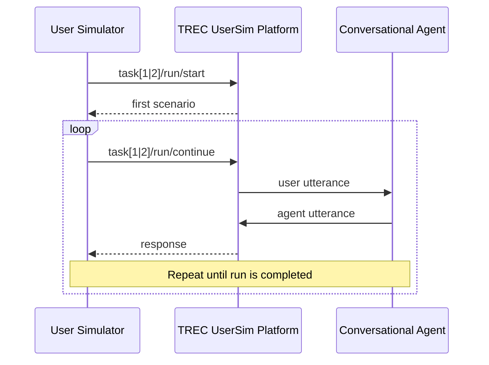

# TREC UserSim Baseline Simulator

> [!NOTE]
> This repository contains a baseline implementation to get started with developing your own user simulator for **TREC UserSim**. More details about the shared task can be found on the [official website](https://trec.usersim.ai/) and in the [guidelines](https://trec.usersim.ai/guidelines). The code integrates the API of the TREC UserSim platform and provides examples for user simulators with simple response strategies. 

**Contents** 
1. [TREC UserSim API](#trec-usersim-api)
2. [TREC UserSim Tasks and Example Outputs](#trec-usersim-tasks-and-example-outputs)
3. [Baseline User Simulator](#baseline-user-simulator)
4. [Setup and Getting Started](#setup-and-getting-started)
5. [Examples](#examples)

## TREC UserSim API

This figure is a high-level, condensed sequence diagram of how to interact with the TREC UserSim platform. More details about the interface can be found in the Swagger-based documentation page of the TREC UserSim API. More detailed sequence diagrams are provided for [Task 1](./docs/task1_workflow.md) and [Task 2](./docs/task2_workflow.md).



The two most important API endpoints are:

- **`task[1|2]/[run|debug]/start`** to start and initiate the official run and debug run submission,
- **`task[1|2]/[run|debug]/continue`** to continue completing the run submission.

A single run covers multiple scenarios (combinations of personas and goals) for which conversations with an agent have to be simulated. Information about the first scenario is returned to the user simulator in response to the first API call (cf. **`task[1|2]/[run|debug]/start`**). 

Once the user simulated has generated an utterance it is sent to the TREC UserSim platform (cf. **`task[1|2]/[run|debug]/continue`**). In response, the platform returns the corresponding interactive utterance made by the conversational agent. This process is repeated until the run is completed.

> [!NOTE]
> You are completely free to implement the API integration from scratch with any tools you prefer. However, if you want to getting started with the development of the user simulator right away, you may want to reuse the existing integration of the API in [`api_client.py`](./simulator/src/api_client.py)

## TREC UserSim Tasks and Example Outputs

More details about about the tasks, including example outputs, are provided here: 

- [Task 1: Turn-level Next Utterance Prediction](./docs/task1_workflow.md)  
- [Task 2: Session-level End-to-End Conversation Generation](./docs/task2_workflow.md).

## Baseline User Simulator

The table below provides short descriptions of how the baseline simulator is implemented in [`./simulator/src/`](./simulator/src/)

| File | Description | 
|---|---| 
| [`user_simulator.py`](./simulator/src/user_simulator.py) | Integrates all other components and coordinates the interaction with the API, the scenario handling, and the response strategy. | 
| [`scenario.py`](./simulator/src/scenario.py) | Contains the data classes of the scenario, including the persona, goal, and persona-goal interactions. | 
| [`response_strategy.py`](./simulator/src/response_strategy.py) | Implements different strategies of how a simulated user generates utterances. | 
| [`api_client.py`](./simulator/src/api_client.py) | Handles the interaction with the TREC UserSim API. | 

## Setup and Getting Started
1. Create virtual environment and install the required packages in `simulator/requirements.txt`.

2. Create a `.env` file (adapt `.env.example` in this repository). Specifically, add `BASE_URL` (address of the backend infrastructure) and assign your team name to `TEAM_NAME`. Upon registration, you receive an authentication token, make sure to include it in `AUTH_TOKEN`.

## Examples
Below, examples for a single conversation and a complete run (comprising multiple conversations/scenarios) are provided. 

### Example #1: Single conversation. 
Run a single conversation with [`single_conversation.py`](./simulator/examples/single_conversation.py).

> [!NOTE]
> Before running this particular script, make sure you have access to an LLM and update the variables `LLM_MODEL` and `LLM_API_BASE` in `.env` accordingly. Alternatively, implement your own `LLMStrategy` or a more light-weight approach.

#### Task 1: Turn-level Next Utterance Prediction
**Debug mode:**
```bash
python -m simulator.examples.single_conversation \
  --task next_utterance_prediction \
  --debug \
  --run-id debug_task1_001 \
  --description "debug, task1"
```

**Official submission:**
```bash
python -m simulator.examples.single_conversation \
  --task next_utterance_prediction \
  --run-id task1_001 \
  --description "official submission, task1"
```

#### Task 2: Session-level End-to-End Conversation Generation
**Debug mode:**
```bash
python -m simulator.examples.single_conversation \
  --task end_to_end_conversation_generation \
  --debug \
  --run-id debug_task2_001 \
  --description "debug, task2"
```

**Official submission:**
```bash
python -m simulator.examples.single_conversation \
  --task end_to_end_conversation_generation \
  --run-id task2_001 \
  --description "official submission, task2"
```

### Example #2: Complete run.
Complete a run submission with [`complete_run.py`](./simulator/examples/complete_run.py).

This example will make use of a simulator with predefined utterances and demonstrates how to complete an entire run submission.

#### Task 1: Turn-level Next Utterance Prediction
**Debug mode:**
```bash
python -m simulator.examples.complete_run \
  --task next_utterance_prediction \
  --debug \
  --run-id debug_task1_001 \
  --description "debug, task1"
```

**Official submission:**
```bash
python -m simulator.examples.complete_run \
  --task next_utterance_prediction \
  --run-id task1_001 \
  --description "official submission, task1"
```
#### Task 2: Session-level End-to-End Conversation Generation
**Debug mode:**
```bash
python -m simulator.examples.complete_run \
  --task end_to_end_conversation_generation \
  --debug \
  --run-id debug_task2_001 \
  --description "debug, task2"
```

**Official submission:**
```bash
python -m simulator.examples.complete_run \
  --task end_to_end_conversation_generation \
  --run-id task2_001 \
  --description "official submission, task2"
```
