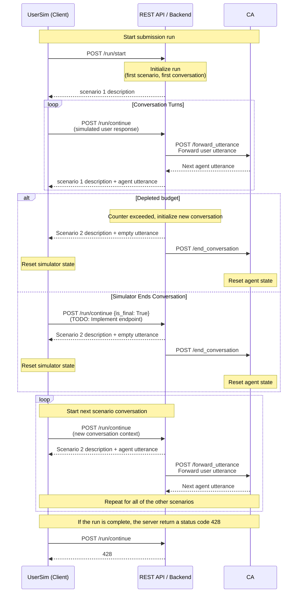

You can edit the diagram directly is this file or with the help of the [mermaid online editor](https://mermaid.ai/live/edit#pako:eNrdVltv2jAU_itH3kvR0pZrB9FUqaOt1Je1KuxlQkJucqDWEjuznd4Q_33HDgRIoS3ansYDiuPvfOfqz5mxSMXIQmbwd44ywnPBp5qnIwn0y7i2IhIZlxYGIs0TbpUGbuCHQU0v4KCfCJS29hp-dnPlgLcXg6F_PoZvPPqFMt4CnRKFA_fPRrLY_q4sgnpAvXIbeFgIA0umYPK7VBgjlASdy6VZCT48PSWnIdxck_tjQhwbZ1agPrmAHKIgvJLCCp6IF3RU8PVOn8LBRGhDXiKUXAsVQLGOlKSYDLfkt1aSOZrDpcdLD-Q-pdxa1JyKCgcqczY8qa2HQDZlxOEG-VjE8LnKUi2N9_d30b-OYmkEDYjRRFr4wJcFTpTKoL_GA8NcS1NsvtMBcm-FzHERoymQGENOwwQaTaakwdqKa6NLBc9E6Ueu4_Gqsp7ssnhdMFXq5Zk2WvQdn-z22u5Tkl398SNePPLEwjlmCbos7_J4inblpzI4q41Kg_sql-QA8ClCjDEOQKxaLvFxo61vpTFYptGspIFpZp93laLSAMpuvO4QtsW95vQWDdIkltpBx9Di1lwLLwW-KOwaFhODawp0IWOzMYb7DeBMmPFE0GkMYahznC8mcnh9fk0HKqWGpc4_5ZopUarb_1fVjygRRIkyGL-aba8EJc1WvXbVL9RauhNXHqOtA_tx4ajOvFtYcrBq07acqlaksCV-j67uko1_plV7SNUbl-QtZsgtTNxtnSSgJmDvCUt_uuyDKXu66OO7V-9VQePuGWGomqmXtsC_pGwevIxbuhCA-zHLHShGaDe7H7ihl23edTN5FhawqRYxCy0d3IClqFPulmzmzEaMQklxxEJ6jHHC88SO2EjOyYw-NX4qlS4ttcqn9yyccFKWgOVZTKdi8e1TQqg0qL3-srDjGVg4Y08sbHTaR616vdOu99rdbqfdot1nFh6edBtHjV6n9aXdaLaa9VZvHrAX77R5VG-edOsnnV6zR5vd9vwPKsMaZQ). 

