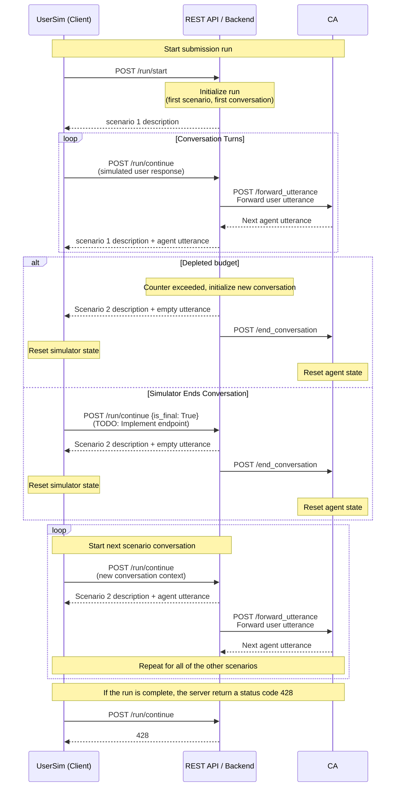

```mermaid
sequenceDiagram
    participant Simulator as UserSim (Client)
    participant API as REST API / Backend
    participant Agent as CA

    Note over Simulator,Agent: Start submission run

    Simulator->>API: POST /run/start
    # API->>Agent: Initialize run <br> (first scenario, first conversation)
    # Agent-->>API: First agent utterance (optional)
    # API-->>Simulator: conversation_id + agent utterance
    Note over API: Initialize run <br> (first scenario, first conversation)
    API-->>Simulator: scenario 1 description

    loop Conversation Turns
        Simulator->>API: POST /run/continue <br> (simulated user response)
        API->>Agent: POST /forward_utterance <br> Forward user utterance
        Agent-->>API: Next agent utterance
        API-->>Simulator: scenario 1 description + agent utterance
    end

    alt Depleted budget
        # Agent-->>API:
        Note over API: Counter exceeded, initialize new conversation
        API-->>Simulator: Scenario 2 description + empty utterance
        API->>Agent: POST /end_conversation 
        Note over Simulator: Reset simulator state
        Note over Agent: Reset agent state
    else Simulator Ends Conversation
        Simulator->>API: POST /run/continue {is_final: True} <br> (TODO: Implement endpoint)
        API-->>Simulator: Scenario 2 description + empty utterance
        API->>Agent: POST /end_conversation 
        Note over Simulator: Reset simulator state
        Note over Agent: Reset agent state
        # API-->>Simulator: conversation closed
    end

    loop 
       Note over Simulator,API: Start next scenario conversation
       Simulator->>API: POST /run/continue <br> (new conversation context)
       # API-->>Simulator: new conversation_id
       API-->>Simulator: Scenario 2 description + agent utterance
       API->>Agent: POST /forward_utterance <br> Forward user utterance
       Agent-->>API: Next agent utterance
       Note over Simulator,Agent: Repeat for all of the other scenarios
    end 
    
    Note over Simulator,Agent: If the run is complete, the server return a status code 428

    Simulator->>API: POST /run/continue
    API-->>Simulator: 428
```