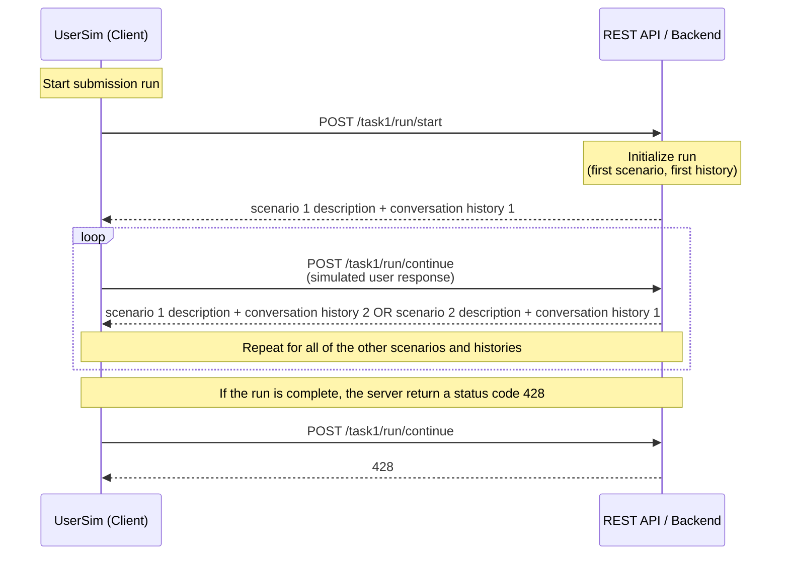

# Task 1: Next Utterance Generation - Workflow & Tasks and Example Outputs

## Workflow



## Tasks and Example Outputs

> [!IMPORTANT]
> The examples use endpoints for the official run submissions but the outputs are equivalent for the debug run endpoints, where `run` would be replaced by `debug` in the route. 

### Task 1: Turn-level Next Utterance Prediction
> [!NOTE]
> This task focuses on a simulator’s ability to model the immediate, reactive behavior of a user at a single turn. It tests local conversational coherence and behavioral realism within an ongoing dialogue.
> - **Input:** A scenario and a partial conversation history (a sequence of preceding user and system turns) and the simulated user’s underlying initial information need.
> - **Output:** The single, predicted next user utterance. Participants may also include associated dialogue acts representing the semantic intent of the simulated utterance.

The client initiates the run with `POST task1/run/start`, which will return the first scenario and the chat history in the response. The client-side user simulator then generates the next utterance which is sent to the infrastructure with `POST task1/run/continue`. The response from the TREC UserSim platform contains next scenario and the corresponding chat history for which the next utterance has to be simulated. The client repeats `POST task1/run/continue` requests and simulates next utterances until the run is completed.

#### Example outputs

`POST task1/run/start`

**Payload of the request:**
```json
{
  "run_id": "5d41402abc4b2a76b9719d911017c592",
  "task_name": "next_utterance_prediction",
  "description": "official submission, task1",
  "team_id": "<YOUR_TEAM_NAME>"
}
```

**Response from the TREC UserSim Platform:**
```json
{
    "conversation_id": "5969273be4de4b21bbbe4e123f030f08",
    "scenario": {
        "goal": {
            "context": "We are exploring ideas from philosophy of language, and linguistics, that describe how conversations are structured. ...",
            "topic": "Recordings of natural-language conversations either between two people, or a person and a machine, ...",
            "discipline": "Social Sciences"
        },
        "persona": {
            "general_info": {
                "gender": "Female",
                "age": "18-34",
                "highest_education": "PhD/Doctorate",
                "proficiency_in_english": "Advanced",
                "tools_used_for_dataset_search": [
                    "Hugging Face Datasets",
                    "Kaggle"
                ]
            },
            "experience_with_ai": {
                "trust": "Very critical",
                "perceived_human_likeness": "High anthropomorphism"
            },
            "individual_traits": {
                "frustration_threshold": "Moderately quickly",
                "interaction_style": "Elaborate"
            }
        },
        "persona_goal_interaction": {
            "domain_familiarity": "Moderately familiar",
            "known_datasets": [
                "MultiWOZ",
                "TREC CAsT and TREC iKAT"
            ]
        }
    },
    "chat_messages": [
        {
            "timestamp": "2026-06-17T05:06:57.999383",
            "conversation_id": "fb0686887ecf4d24b69ff5454e0ca1a8",
            "participant_name": "user",
            "text": "I am looking for datasets of multi turn conversations. ...",
            "sources": [],
            "annotations": {},
            "is_final": false
        },
        {
            "timestamp": "2026-06-17T05:07:36.943677",
            "conversation_id": "fb0686887ecf4d24b69ff5454e0ca1a8",
            "participant_name": "agent",
            "text": "Below are a handful of public resources that meet most (or all) of the criteria you mentioned ...",
            "sources": [],
            "annotations": {
                "helpful": false,
                "dataset_quality": "Unlikely to be useful",
                "feedback": "The recommended datasets do not include multi-turn, goal-driven dialogue collections."
            },
            "is_final": false
        },
        {
            "timestamp": "2026-06-17T05:18:57.504701",
            "conversation_id": "fb0686887ecf4d24b69ff5454e0ca1a8",
            "participant_name": "user",
            "text": "Hmm, can you suggest any English, multi-turn, goal-driven dialogue collections?",
            "sources": [],
            "annotations": {},
            "is_final": false
        },
        {
            "timestamp": "2026-06-17T05:19:53.580027",
            "conversation_id": "fb0686887ecf4d24b69ff5454e0ca1a8",
            "participant_name": "agent",
            "text": "Below is a list of English, multi-turn, goal-driven dialogue collections ...",
            "sources": [],
            "annotations": {
                "helpful": false,
                "dataset_quality": "Some promising datasets",
                "feedback": ""
            },
            "is_final": false
        }
    ]
}
```

`POST task1/run/continue`

**Payload of the request:**
```json
{
    "run_id": "5d41402abc4b2a76b9719d911017c592",
    "user_utterance": {
        "timestamp": "2026-06-17T05:19:57.480027",
        "conversation_id": "fb0686887ecf4d24b69ff5454e0ca1a8",
        "participant_name": "user",
        "text": "Can you provide more details about the second dataset you mentioned, such as its size, the number of conversations, and the types of goals it covers?",
        "sources": [],
        "annotations": {},
        "is_final": false
  }
}
```