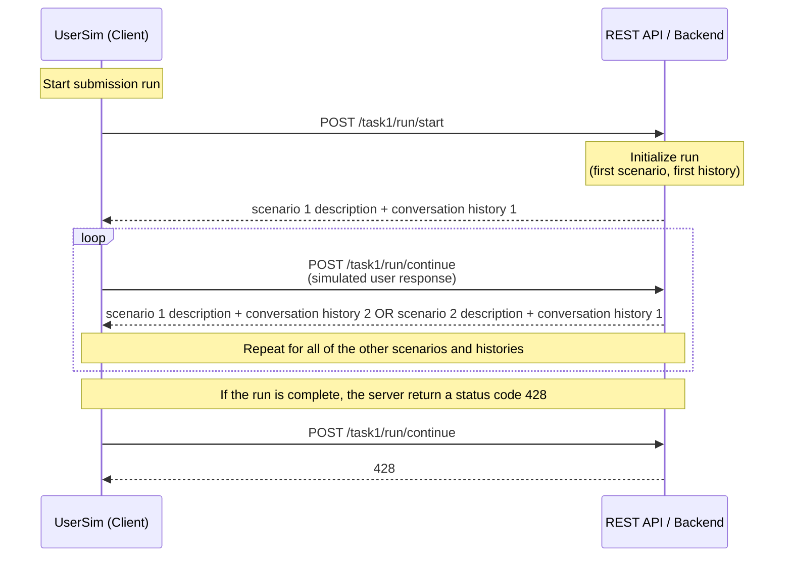

# Task 1: Next Utterance Generation - Workflow

```mermaid
sequenceDiagram
    participant Simulator as UserSim (Client)
    participant API as REST API / Backend

    Note over Simulator: Start submission run

    Simulator->>API: POST /task1/run/start
    Note over API: Initialize run <br> (first scenario, first history)
    API-->>Simulator: scenario 1 description + conversation history 1

    loop 
        Simulator->>API: POST /task1/run/continue <br> (simulated user response)
        API-->>Simulator: scenario 1 description + conversation history 2 OR scenario 2 description + conversation history 1
        Note over Simulator,API: Repeat for all of the other scenarios and histories
    end

    Note over Simulator,API: If the run is complete, the server return a status code 428

    Simulator->>API: POST /task1/run/continue
    API-->>Simulator: 428
```
