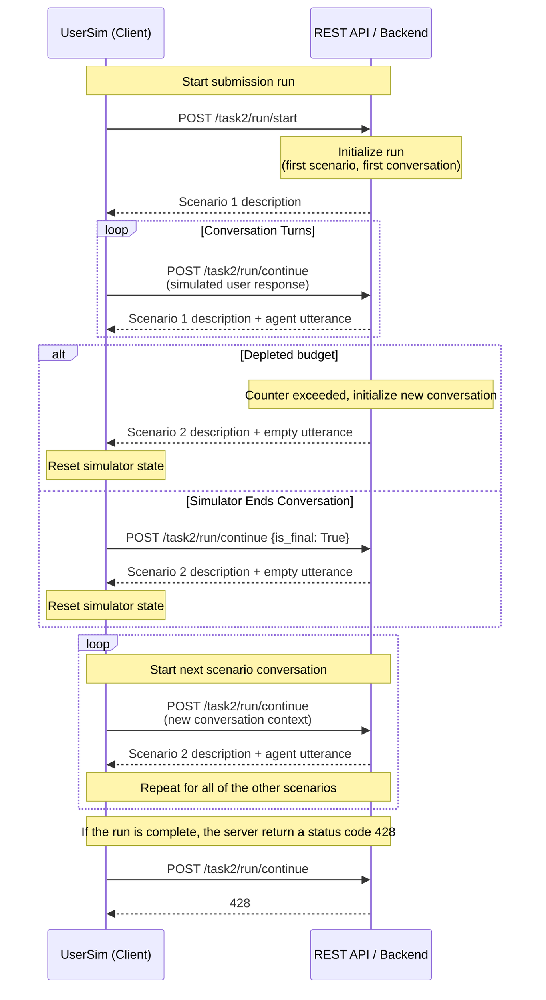

# Task 2: End-to-End Conversation - Workflow

```mermaid
sequenceDiagram
    participant Simulator as UserSim (Client)
    participant API as REST API / Backend

    Note over Simulator,API: Start submission run

    Simulator->>API: POST /task2/run/start
    Note over API: Initialize run <br> (first scenario, first conversation)
    API-->>Simulator: Scenario 1 description

    loop Conversation Turns
        Simulator->>API: POST /task2/run/continue <br> (simulated user response)
        API-->>Simulator: Scenario 1 description + agent utterance
    end

    alt Depleted budget        
        Note over API: Counter exceeded, initialize new conversation
        API-->>Simulator: Scenario 2 description + empty utterance
        Note over Simulator: Reset simulator state
    else Simulator Ends Conversation
        Simulator->>API: POST /task2/run/continue {is_final: True}
        API-->>Simulator: Scenario 2 description + empty utterance
        Note over Simulator: Reset simulator state
    end

    loop 
       Note over Simulator,API: Start next scenario conversation
       Simulator->>API: POST /task2/run/continue <br> (new conversation context)
       API-->>Simulator: Scenario 2 description + agent utterance
       Note over Simulator,API: Repeat for all of the other scenarios
    end 
    
    Note over Simulator,API: If the run is complete, the server return a status code 428

    Simulator->>API: POST /task2/run/continue
    API-->>Simulator: 428
```
