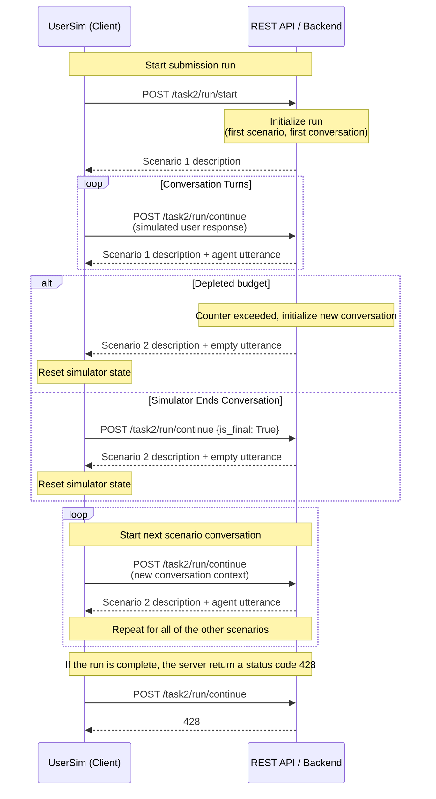

# Task 2: End-to-End Conversation - Workflow & Tasks and Example Outputs

## Workflow



## Tasks and Example Outputs

> [!IMPORTANT]
> The examples use endpoints for the official run submissions but the outputs are equivalent for the debug run endpoints, where `run` would be replaced by `debug` in the route.

### Task 2: Session-level End-to-End Conversation Generation
>
> [!NOTE]
> This task evaluates a simulator’s ability to strategically manage an entire conversation to achieve a predefined goal. It tests high-level planning, conversational persistence, and the simulator's ability to recognize task success.
>
>   - **Input:** A scenario that specifies the simulated user’s persona and goals.
>   - **Output:** A complete, multi-turn conversation. The simulator must dynamically interact with the provided system, generating sequential turns until the simulator autonomously decides the goal is satisfied or that the search should be abandoned.

The client initiates the run with `POST task2/run/start`, which will return the first scenario in the response. The client-side user simulator then generates the first utterance which is sent to the infrastructure with `POST task2/run/continue`. The corresponding response contains the chat history, including the utterance made by the agent in response to the simulated user's utterance. The user simulator continues the conversation by sending the next utterance with `POST task2/run/continue` until the conversation is finished.

The conversation ends either when (1) the conversation budget is depleted (tracked by the infrastructure) or (2) the user simulator decides to end the conversation. Closing a conversation is handled by the boolean parameter `is_final` in the payload of the response or request body, depending on which party decides to end the conversation. In both cases, the infrastructure returns a response with status code `201` and information about the next scenario. The user simulator then continues completing the next conversation of a new scenario. Technically, the user simulator sends `POST /run/continue` requests until the run is completed, i.e., all end-to-end conversations are simulated for all scenario-agent combinations. Once the run is completed, it is signalled by the status code `428` to the user simulator.

#### Example outputs

`POST task2/run/start`

**Payload of the request:**

```json
{
  "run_id": "5d41402abc4b2a76b9719d911017c592",
  "task_name": "end_to_end_conversation_generation",
  "description": "official submission, task1",
  "team_id": "<YOUR_TEAM_NAME>"
}
```

**Response from the TREC UserSim Platform:**

```json
{
    "conversation_id": "5969273be4de4b21bbbe4e123f030f08",
    "scenario": {
        "goal": {
            "context": "We are exploring ideas from philosophy of language, and linguistics, that describe how conversations are structured. ...",
            "topic": "Recordings of natural-language conversations either between two people, or a person and a machine, ...",
            "discipline": "Social Sciences"
        },
        "persona": {
            "general_info": {
                "gender": "Female",
                "age": "18-34",
                "highest_education": "PhD/Doctorate",
                "proficiency_in_english": "Advanced",
            },
            "experience_with_ai": {
                "trust": "Very critical",
                "perceived_human_likeness": "High anthropomorphism"
            },
            "individual_traits": {
                "frustration_threshold": "Moderately quickly",
                "interaction_style": "Elaborate"
            }
        },
        "persona_goal_interaction": {
            "domain_familiarity": "Moderately familiar",
            "known_datasets": [
                "MultiWOZ",
                "TREC CAsT and TREC iKAT"
            ]
        }
    }
}
```

`POST task2/run/continue`

**Payload of the request:**

```json
{
    "run_id": "5d41402abc4b2a76b9719d911017c592",
    "user_utterance": {
        "timestamp": "2026-06-17T05:06:57.999383",
        "conversation_id": "fb0686887ecf4d24b69ff5454e0ca1a8",
        "participant_name": "user",
        "text": "Hello, I need datasets containing conversations to analyze how conversations are structured ...",
        "sources": [],
        "annotations": {},
        "is_final": false
  }
}
```

**Response from the TREC UserSim Platform:**

```json
{
    "conversation_id": "5969273be4de4b21bbbe4e123f030f08",
    "scenario": {...},
    "chat_messages": [
        {
            "timestamp": "2026-06-17T05:06:57.999383",
            "conversation_id": "fb0686887ecf4d24b69ff5454e0ca1a8",
            "participant_name": "user",
            "text": "Hello, I need datasets containing conversations to analyze how conversations are structured ...",
            "sources": [],
            "annotations": {},
            "is_final": false
        },
        {
            "timestamp": "2026-06-17T05:07:36.943677",
            "conversation_id": "fb0686887ecf4d24b69ff5454e0ca1a8",
            "participant_name": "agent",
            "text": "Greetings, below you can find several datasets that meet your requirements ...",
            "sources": [
                "https://aclanthology.org/D18-1547/", 
                "https://trec.nist.gov/data/cast.html"
            ],
            "annotations": {},
            "is_final": false
        }
    ]
}
```
